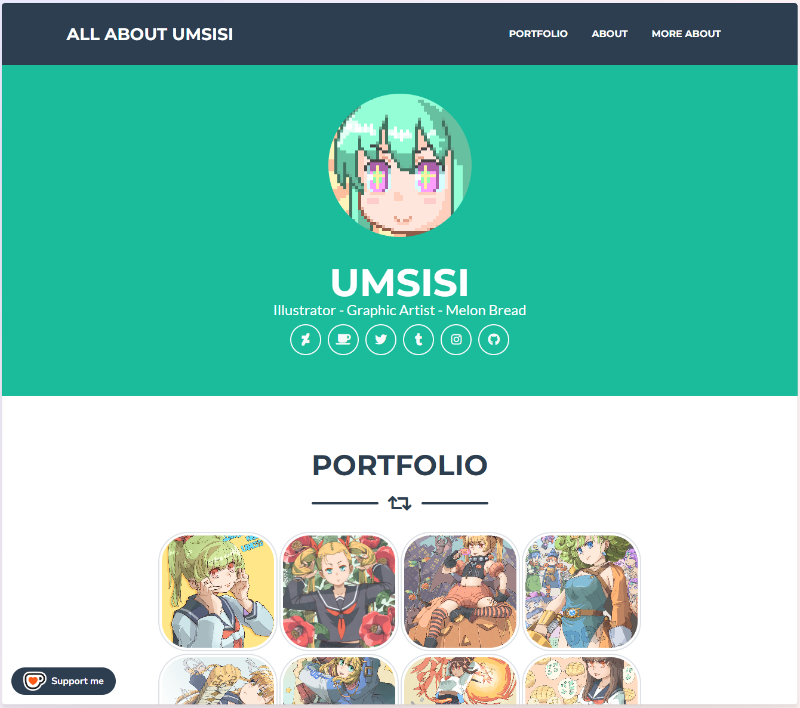

 
URL: <a href="https://umsisi.github.io/">https://umsisi.github.io/</a> 

### || はじめに
イラストレーターの **umsisi/うむしし** と申します。  
Github PagesでLink in Bio的な役割を兼ねたPORTFOLIOページを作ってみたので備忘録を兼ねたREADMEをこちらに記しておきたいと思います。

各SNSからここへ飛んでもらって興味を持ってもらえたら良いなと思っております。

HTML作成にあたりCSSフレームワークとして [Bootstrap](https://getbootstrap.jp/) を  
BootstrapのTemplateとして [startbootstrap-freelancer](https://github.com/StartBootstrap/startbootstrap-freelancer) を  
画像のポップアップ拡大表示には [baguetteBox.js](https://github.com/feimosi/baguetteBox.jsr) を  
それぞれ使用させていただきました。大変ありがとうございます。

このPORTFOLIOの作成顛末などはそのうちブログかQiitaにまとめたいです。

自他ともに認める理系音痴の文系イラスト系人間でもGithubでコミットしてリモートリポジトリにプッシュできる時代が来たことにむせび泣いております。世の「死ぬまでに一度は理系になりたかった人生だった系文系人間」の皆様にも是非Github PagesでPORTFOLIO作ってほしいなと思う次第です。README.mdってナニ書けばいいんですか…。

最後にVisual studio codeでのREADME.md編集には Markdown Preview Enhanced プラグインが最高にクールです。これさえあればMarkdownなにするものぞです。作者様に100万の感謝を。

### || 有用なリンク集
- [GitHub Pages のドキュメント](https://docs.github.com/ja/pages)
- [Shields.io を使ってバッジを表示する](https://qiita.com/fujithuro/items/a8561983028c731309cf)
- [Shields.io](https://shields.io/) | [Simple Icons slugs](https://github.com/simple-icons/simple-icons/blob/master/slugs.md)
- [おしゃれなREADME.mdを作って「このプロダクト凄そう..!(?)」と勘違いさせたいあなたへ](https://zenn.dev/nixieminton/articles/692f3b0c4cc337)

2024/11/29 umsisi